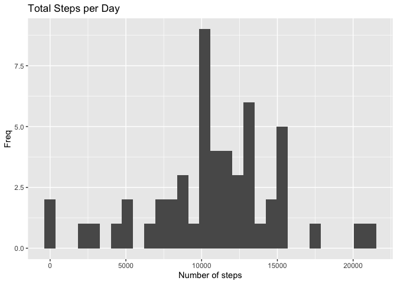
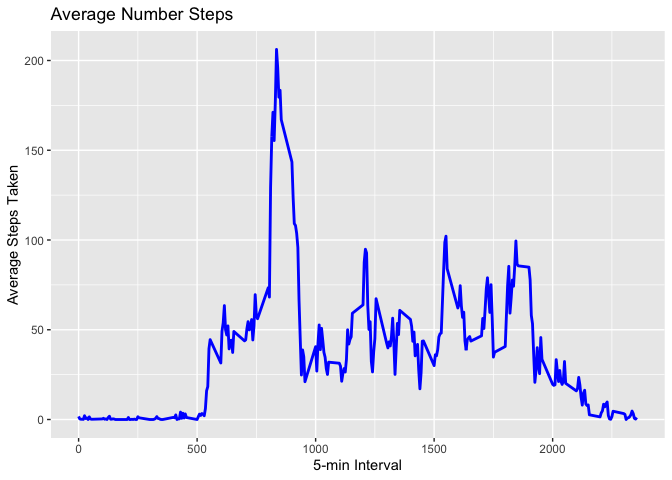
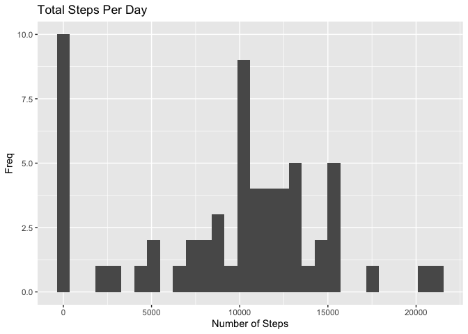
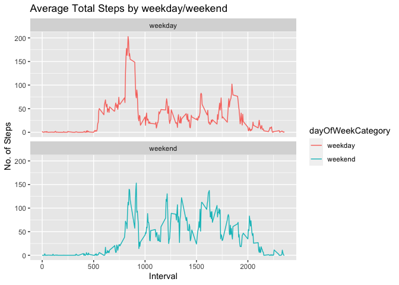

## Necessary libraries

```r
library("data.table")
library("ggplot2")
```

## Loading and preprocessing the data
Unzip data and load CSV:

```r
unzip("activity.zip", exdir="data")
activityData <- data.table::fread(input="data/activity.csv")
```

## What is mean total number of steps taken per day?

1. Calculate the total number of steps taken per day


```r
totalSteps <- activityData[, c(lapply(.SD, sum, na.rm=FALSE)), .SDcols=c("steps"), by=.(date)] 
head(totalSteps)
```

```
##          date steps
## 1: 2012-10-01    NA
## 2: 2012-10-02   126
## 3: 2012-10-03 11352
## 4: 2012-10-04 12116
## 5: 2012-10-05 13294
## 6: 2012-10-06 15420
```

2. Make a histogram of the total number of steps taken each day. 
for hist: fill="blue", binwidth=1000

```r
ggplot(totalSteps, aes(x=steps)) + geom_histogram() + labs(title="Total Steps per Day", x="Number of steps", y="Freq")
```

```
## `stat_bin()` using `bins = 30`. Pick better value with `binwidth`.
```

```
## Warning: Removed 8 rows containing non-finite values (stat_bin).
```

<!-- -->

3. Calculate and report the mean and median of the total number of steps taken per day

```r
totalSteps[, .(meanSteps = mean(steps, na.rm=TRUE), medianSteps=median(steps, na.rm=TRUE))]
```

```
##    meanSteps medianSteps
## 1:  10766.19       10765
```

## What is the average daily activity pattern?

1. Make a time series plot of the 5-minute interval (x-axis) and the average number of steps taken, averaged across all days (y-axis)


```r
intervalData <- activityData[, c(lapply(.SD, mean, na.rm=TRUE)), .SDcols = c("steps"), by = .(interval)] 
ggplot(intervalData, aes(x=interval , y=steps)) + geom_line(color="blue", size=1) + labs(title ="Average Number Steps", x = "5-min Interval", y = "Average Steps Taken")
```

<!-- -->

2. Which 5-minute interval, on average across all the days in the dataset, contains the maximum number of steps?


```r
intervalData[steps == max(steps), .(maxInterval=interval)]
```

```
##    maxInterval
## 1:         835
```


## Imputing missing values

1. Calculate and report the total number of missing values in the dataset (i.e. the total number of rows with 𝙽𝙰s)


```r
nrow(activityData[is.na(steps),])
```

```
## [1] 2304
```

2. Devise a strategy for filling in all of the missing values in the dataset. The strategy does not need to be sophisticated. For example, you could use the mean/median for that day, or the mean for that 5-minute interval, etc.

I chose to fill in with the median:


```r
activityData[is.na(steps), "steps"] <- activityData[, c(lapply(.SD, median, na.rm=TRUE)), .SDcols=c("steps")]
```

3. Create a new dataset that is equal to the original dataset but with the missing data filled in.


```r
data.table::fwrite(x=activityData, file="data/activity_cleaned.csv", quote=FALSE)
```

4. Make a histogram of the total number of steps taken each day and calculate and report the mean and median total number of steps taken per day. Do these values differ from the estimates from the first part of the assignment? What is the impact of imputing missing data on the estimates of the total daily number of steps?


```r
totalSteps <- activityData[, c(lapply(.SD, sum)), .SDcols = c("steps"), by = .(date)] 
totalSteps[, .(meanSteps=mean(steps), medianSteps=median(steps))]
```

```
##    meanSteps medianSteps
## 1:   9354.23       10395
```

```r
ggplot(totalSteps, aes(x=steps)) + geom_histogram() + labs(title="Total Steps Per Day", x="Number of Steps", y="Freq")
```

```
## `stat_bin()` using `bins = 30`. Pick better value with `binwidth`.
```

<!-- -->

## Are there differences in activity patterns between weekdays and weekends?

1. Create a new factor variable in the dataset with two levels – “weekday” and “weekend” indicating whether a given date is a dayOfWeekCategory day.


```r
activityData[, date := as.POSIXct(date, format="%Y-%m-%d")]
activityData[, `dayOfWeek` := weekdays(x=date)]
activityData[grepl(pattern="Sunday|Saturday", x=`dayOfWeek`), "dayOfWeekCategory"] <- "weekend"
activityData[grepl(pattern="Monday|Tuesday|Wednesday|Thursday|Friday", x=`dayOfWeek`), "dayOfWeekCategory"] <- "weekday"
activityData[, `dayOfWeekCategory` := as.factor(`dayOfWeekCategory`)]
head(activityData)
```

```
##    steps       date interval dayOfWeek dayOfWeekCategory
## 1:     0 2012-10-01        0    Monday           weekday
## 2:     0 2012-10-01        5    Monday           weekday
## 3:     0 2012-10-01       10    Monday           weekday
## 4:     0 2012-10-01       15    Monday           weekday
## 5:     0 2012-10-01       20    Monday           weekday
## 6:     0 2012-10-01       25    Monday           weekday
```

2. Make a panel plot containing a time series plot of the 5-minute interval (x-axis) and the average number of steps taken, averaged across all weekday days or weekend days (y-axis). See the README file in the GitHub repository to see an example of what this plot should look like using simulated data.


```r
activityData[is.na(steps), "steps"] <- activityData[, c(lapply(.SD, median, na.rm=TRUE)), .SDcols=c("steps")]
intervalData <- activityData[, c(lapply(.SD, mean, na.rm=TRUE)), .SDcols=c("steps"), by=.(interval, `dayOfWeekCategory`)] 
ggplot(intervalData, aes(x=interval, y=steps, color=`dayOfWeekCategory`)) + geom_line() + facet_wrap(~`dayOfWeekCategory`, nrow=2, ncol=1) + labs(title="Average Total Steps by weekday/weekend", x ="Interval", y="No. of Steps")
```

<!-- -->
